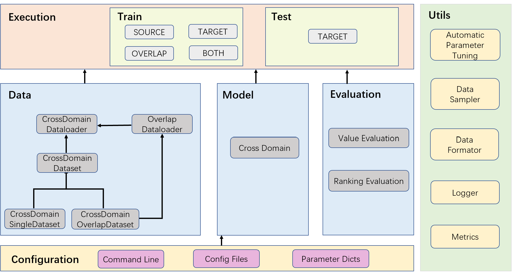

# MF-GSLAE

Official implementation for **MF-GSLAE: A Multi-Factor User Representation Pre-Training Framework for Dual-Target Cross-Domain Recommendation**.

[](https://doi.org/10.1145/3690382)
[](https://ustc-starteam.github.io/MF-GSLAE/)

## 1. Paper

Hao Wang, Mingjia Yin, Luankang Zhang, Sirui Zhao, and Enhong Chen. **MF-GSLAE: A Multi-Factor User Representation Pre-Training Framework for Dual-Target Cross-Domain Recommendation**. *ACM Transactions on Information Systems*, 43(2):1-28, 2025.

[Paper](https://doi.org/10.1145/3690382) / [Project Page](https://ustc-starteam.github.io/MF-GSLAE/) / [Citation](#12-citation)

MF-GSLAE learns fine-grained user preference factors for dual-target cross-domain recommendation. It pre-trains multi-factor user representations, learns graph structures for preference propagation, and adaptively selects domain-related factors to reduce negative transfer.

## 2. Highlights

- Targets dual-target cross-domain recommendation where both source and target domains should improve.
- Learns multiple fine-grained user preference factors instead of a single coarse representation.
- Builds graph structure learning into user representation pre-training.
- Provides reproducible configurations for Epinions, Douban, and Amazon cross-domain datasets.

## 3. Method At A Glance



MF-GSLAE first extracts multiple preference factors from cross-domain behavior, then propagates factor-level relations and selects transferable factors for each target domain.

## 4. Repository Structure

```text
.
├── recbole_cdr/model/cross_domain_recommender/mfgslae.py  # MF-GSLAE model
├── recbole_cdr/                                           # RecBole-CDR framework code
├── config/                                                # Dataset config files
├── dataset/                                               # Included processed datasets
├── asset/arch.png                                         # Architecture figure
├── run_recbole_cdr.py                                     # Training entry
└── docs/                                                  # GitHub Pages project page
```

## 5. Installation

The paper experiments used:

```text
recbole==1.0.1
torch>=1.7.0
python>=3.7.0
```

Install the environment according to your CUDA/PyTorch setup, then install RecBole-compatible dependencies.

## 6. Data

Processed datasets are included under `dataset/`:

- `dataset/epinions-*`
- `dataset/DoubanBook` and `dataset/DoubanMovie`
- `dataset/ama-*`

The model configuration file is `recbole_cdr/properties/model/MFGSLAE.yaml`.

## 7. Quick Start

Run one of the prepared dataset configurations:

```bash
python run_recbole_cdr.py --model=MFGSLAE --config_files=./config/epinions.yaml --gpu_id=1
```

## 8. Reproducing Results

### Epinions

Set `recbole_cdr/properties/model/MFGSLAE.yaml`:

```yaml
dropout_prob: 0.7
tau: 0.5
factor: 4
epsilon: 5
alpha: 0.1
ratio: 0.99
ratio_threshold: 0.5
l1_rate: 1e-06
learning_rate: 0.001
weight_decay: 0.01
latent_dimension: 64
use_user_loader: true
```

Run:

```bash
python run_recbole_cdr.py --model=MFGSLAE --config_files=./config/epinions.yaml --gpu_id=1
```

### Douban

Set `recbole_cdr/properties/model/MFGSLAE.yaml`:

```yaml
dropout_prob: 0.5
tau: 2
factor: 4
epsilon: 0.5
alpha: 0.01
ratio: 0.99
ratio_threshold: 0.5
l1_rate: 1e-06
learning_rate: 0.001
weight_decay: 0.01
latent_dimension: 64
use_user_loader: true
```

Run:

```bash
python run_recbole_cdr.py --model=MFGSLAE --config_files=./config/douban_bmovie.yaml --gpu_id=1
```

### Amazon

Set `recbole_cdr/properties/model/MFGSLAE.yaml`:

```yaml
dropout_prob: 0.9
tau: 1
factor: 8
epsilon: 1
alpha: 0.001
ratio: 0.99
ratio_threshold: 0.5
l1_rate: 1e-06
learning_rate: 0.001
weight_decay: 0.0001
latent_dimension: 64
use_user_loader: true
```

Run:

```bash
python run_recbole_cdr.py --model=MFGSLAE --config_files=./config/ama-elecmov.yaml --gpu_id=1
```

## 9. Configuration Notes

- `factor` controls the number of learned preference factors.
- `tau`, `epsilon`, and `alpha` tune the factor-learning and transfer behavior.
- `use_user_loader: true` is required by the reproduced settings above.

## 10. Experimental Highlights

The paper reports effectiveness across multiple dual-target cross-domain recommendation datasets. The public repository exposes reproduction settings for Epinions, Douban Book-Movie, and Amazon Electronics-Movies.

| Reproducible setting in this repository | Evidence exposed by the release |
| --- | --- |
| Evaluation protocol | `recall`, `mrr`, `ndcg`, `hit`, and `precision` are configured in `recbole_cdr/properties/overall.yaml`. |
| Validation target | The dataset configs use `NDCG@20` as the validation metric. |
| Dataset-specific tuning | The README provides separate hyperparameter blocks for Epinions, Douban, and Amazon cross-domain settings. |
| Model interpretation | The factor learning and selection modules separate user preferences into multiple subspaces to reduce negative transfer. |

The ACM-hosted paper tables are not mirrored in this repository and the publisher PDF was not directly accessible during this pass, so exact leaderboard values are intentionally not restated here. Use the reproduction commands above to regenerate the reported metrics.

**Conclusion:** MF-GSLAE's public evidence is strongest on reproducibility structure and evaluation protocol; exact numeric table values should be added once an accessible official source or released result artifact is available.

## 11. Notes For Maintainers

- Keep the canonical implementation path visible: `recbole_cdr/model/cross_domain_recommender/mfgslae.py`.
- Preserve the dataset-specific hyperparameter blocks because they are the fastest route to reproducing reported results.
- If dependency versions are updated, verify compatibility with RecBole-CDR before changing the installation section.

## 12. Citation

If you find this repository useful, please cite:

```bibtex
@article{wang2025mfgslae,
  title={MF-GSLAE: A Multi-Factor User Representation Pre-Training Framework for Dual-Target Cross-Domain Recommendation},
  author={Wang, Hao and Yin, Mingjia and Zhang, Luankang and Zhao, Sirui and Chen, Enhong},
  journal={ACM Transactions on Information Systems},
  volume={43},
  number={2},
  pages={1--28},
  year={2025},
  doi={10.1145/3690382}
}
```

## 13. Contact

- First author: Hao Wang (`wanghao3@ustc.edu.cn`).
- Repository questions: please open a GitHub issue in this repository.
